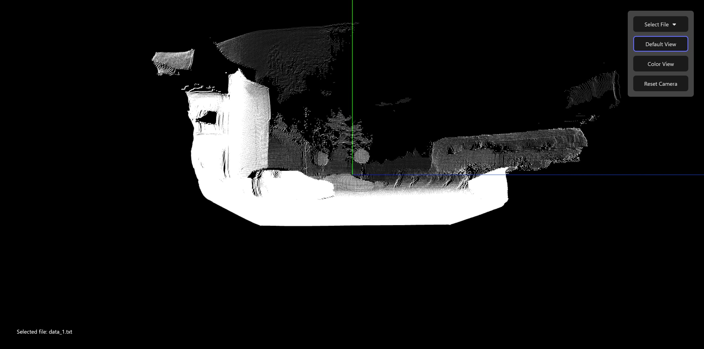
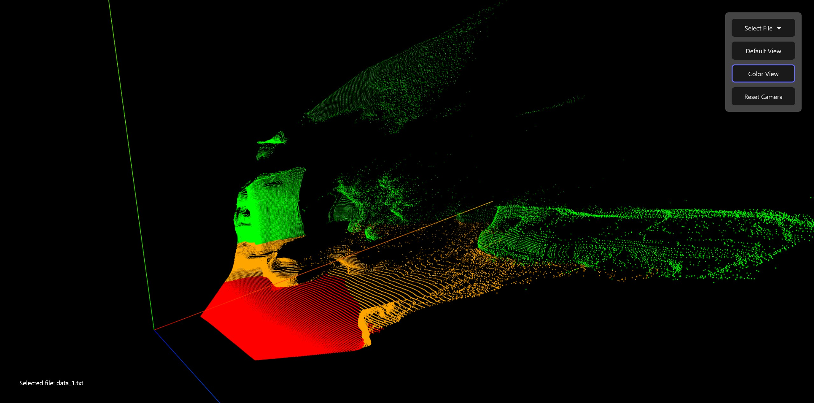

# Point Cloud Viewer


## Table of Contents
- [Description](#description)
- [Features](#features)
- [Tech Stack](#tech-stack)
- [Installation](#installation)
- [Results](#results)
- [License](#license)

## Description
A web application for visualizing 3D point cloud data from `.txt` files.

It allows users to:
- Upload own or select one of provided .txt files containing points coordinates.
- View points in 3D using interactive camera.
- Switch between default view (white) and color view (red/orange/green).
- Reset camera view to the original view.

The project consist of:
- **Backend:** FastAPI (serving the point cloud data via API endpoints)
- **Frontend:** React (Vite) + Three.js (interactive visualization of point cloud and user interface)

## Features
- Drag and drop .txt files or select from a list.
- Automatic color coding based on point height.
- Responsive 3D visualization with zoom, rotate, and pan.
- Containerized with Docker for easy setup, avaible as:
    - A single image with the built React app served by FastAPI
    - Two separate containers (backend and frontend) using Docker Compose.

## Tech Stack
**Frontend:** React (Vite), Three.js

**Backend:** Python, FastAPI, Uvicorn

**Containerization:** Docker, Docker Compose

## Installation

### Run the app with Docker

Make sure [Docker](https://www.docker.com/get-started/) is installed on your system.

1. Clone the repository:
```
git clone https://github.com/szewczem/point-cloud-viewer
cd point-cloud-viewer
```
2. Build the Docker image:
```
docker build -t point-cloud-viewer .
```
3. Run the container:
```
docker run -p 8000:8000 --name point-cloud-viewer point-cloud-viewer
```
4. Open your browser and go to:
```
http://127.0.0.1:8000/
```

### Run the app locally (without Docker)
1. Clone the repository:
```
git clone https://github.com/szewczem/point-cloud-viewer
cd point-cloud-viewer
```
2. Navigate to the backend and create virtual environment for python:

Make sure [Python 3.12](https://www.python.org/downloads/) is installed on your system.
```
cd backend
```
Windows:
```
python -m venv .venv
.venv\Scripts\activate
```
Linux/Mac:
```
python3 -m venv .venv
source .venv/bin/activate
```
3. Install dependencies:
```
pip install -r requirements.txt
```
4. Run the FastAPI server:
```
uvicorn main:app --reload
```
The backend will be now running at:
```
http://127.0.0.1:8000
```
6. Open a new terminal and navigate to the frontend folder:
```
cd frontend
```
7. Install dependencies:

Make sure [Node 22.20.0](https://nodejs.org/en/download) is installed on your system.
```
npm install
```
8. Start the development server:
```
npm run dev
```
9. The frontend will start at:
```
http://localhost:5173
```

**The app will be working from above url as by default the frontend fetches data from backend.**

### Project Structure:
```
point-cloud-viewer/
├── backend/              # FastAPI backend
│ ├── main.py             # Main API entry point
│ ├── point_loader.py     # Helper for reading and parsing .txt point data
│ ├── data/               # .txt point cloud files
│ ├── requirements.txt    # Python dependencies
│ └── Dockerfile          # Backend Docker configuration (optional)
│
├── frontend/             # React + Vite + Three.js frontend
│ ├── src/                # Frontend source files (App.jsx, components, etc.)
│ ├── package.json        # Frontend dependencies
│ └── Dockerfile          # Frontend Docker configuration (optional)
│
├── docker-compose.yml    # Run backend & frontend together (optional)
├── Dockerfile            # App Docker configuration
└── README.md             # Documentation (this file)
```

## Results
### Start view:


### Default data view:


### Modified data view:


## License

This project is licensed under the MIT License. See [LICENSE](LICENSE) for details.